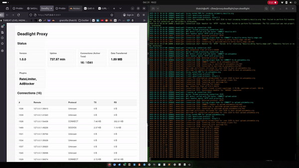

# Deadlight Proxy

A high-performance, multi-protocol proxy server written in C using GLib. Features include a kernel-integrated VPN gateway, deep packet inspection, automatic protocol detection, and extensible plugins for custom functionality.

[Features](#features) · [Getting Started](#getting-started) · [Usage](#usage) · [Configuration](#configuration) · [Architecture](#architecture) · [Extending Deadlight](#extending-deadlight) · [Use Cases](#use-cases) · [Roadmap](#roadmap) · [License](#license)



## Overview

Deadlight Proxy is a versatile, standalone proxy server designed for efficiency and extensibility. Built in C with the GLib ecosystem, it handles a wide range of network protocols through a unified architecture. Key capabilities include automatic protocol detection, TLS interception for secure traffic analysis, plugin-based customization, and a built-in VPN gateway mode. It also features a simple web UI for real-time monitoring and control.

Whether you're setting up a secure home network gateway, bridging protocols for modern applications, or adding custom filters to your traffic, Deadlight provides a lightweight, scalable solution.

### What Makes Deadlight Unique?

- **Multi-Protocol Support in One Binary**: Seamlessly handles HTTP/HTTPS, SOCKS4/5, WebSocket, SMTP, IMAP/IMAPS, FTP, and more—without needing separate daemons.
- **Kernel-Level VPN Integration**: Operates as a true Layer 3 VPN using Linux TUN devices, routing any TCP/IP traffic transparently with kernel-optimized performance.
- **Intelligent TLS Interception**: Dynamically generates certificates that mimic upstream servers for transparent HTTPS inspection (with security considerations—see below).
- **Plugin Extensibility**: Easily add features like ad blocking, rate limiting, or custom filters via modular plugins.
- **Stateless Design**: Offloads state management (e.g., no local databases or queues), making it lightweight and easy to deploy.
- **Secure Connectivity Options**: Integrates with tools like Tailscale for mesh networking, keeping your setup private and firewall-friendly.
- **Performance-Focused**: Includes connection pooling, worker threads, async I/O, and graceful shutdown for high-throughput scenarios.

Deadlight can run standalone or as part of larger systems, such as the Deadlight Edge Platform for Cloudflare Workers integration (see [edge.deadlight](https://github.com/gnarzilla/edge.deadlight) for details).


## Features

- **Automatic Protocol Detection**: Peeks at initial connection data to identify and route protocols without configuration.
- **TLS/SSL Interception**: Supports man-in-the-middle inspection with certificate caching and system trust validation.
- **Connection Pooling**: Reuses upstream connections for efficiency, with health checks and idle timeouts.
- **Plugin System**: Hooks for request/response modification, connection events, and config changes (e.g., built-in ad blocker and rate limiter).
- **VPN Gateway Mode**: Kernel-integrated tunneling for full IP routing, ideal for secure gateways.
- **Web UI Dashboard**: Real-time stats, connection monitoring, and control (optional, enabled via build flag).
- **Config Hot-Reloading**: Monitors config file for changes and applies them without restart.
- **Comprehensive Logging and Stats**: Tracks connections, bytes transferred, and plugin metrics.
- **Security Tools**: Built-in loop prevention, rate limiting, and extensible filters.

## Getting Started

### Prerequisites

- Linux (recommended for VPN features; other OSes supported for basic proxying)
- GLib 2.0+ and GIO
- OpenSSL 1.1+ (for TLS support)
- GCC or Clang for building

### Installation

1. Clone the repository:
   ```
   git clone https://github.com/gnarzilla/proxy.deadlight.git
   cd proxy.deadlight
   ```

2. Build the project:
   ```
   make
   ```
   - For UI support: `make ENABLE_UI=1`
   - For debug builds: `make DEBUG=1`

3. Install (optional, copies to /usr/local/bin):
   ```
   sudo make install
   ```

4. Generate SSL CA (for interception):
   ```
   sudo mkdir -p /etc/deadlight
   sudo ./bin/deadlight --generate-ca
   ```
   Install the generated `/etc/deadlight/ca.crt` in your system's trust store or browser for seamless HTTPS proxying.

### Quick Start

Run the proxy on port 8080:
```
./bin/deadlight -p 8080
```

Test with curl:
```
curl -x http://localhost:8080 http://example.com
```

For VPN mode (requires root):
```
sudo ./bin/deadlight --vpn
```

## Usage

Configure your applications or system to use `localhost:8080` as the proxy. Deadlight auto-detects protocols, so no per-protocol setup is needed.

### Command-Line Options

- `-c, --config FILE`: Specify configuration file (default: `/etc/deadlight/deadlight.conf`).
- `-p, --port PORT`: Listening port (overrides config).
- `-d, --daemon`: Run in background as a daemon.
- `-v, --verbose`: Enable debug logging.
- `--pid-file FILE`: PID file for daemon mode.
- `-t, --test MODULE`: Run tests for a specific module (e.g., "network", "all").
- `-h, --help`: Display usage information.

### Examples

#### HTTP Proxy with TLS Interception
Trust the CA first, then:
```
curl -x http://localhost:8080 https://example.com
```

#### SOCKS5 Proxy
```
curl --socks5 localhost:8080 http://example.com
```

#### SMTP Tunneling
Use an email client configured to `localhost:8080` as the SMTP server—it will tunnel to the upstream.

#### FTP Proxy
```
lftp -p 8080 ftp://ftp.example.com
```

#### API Status Check
```
curl http://localhost:8080/api/status
```

#### VPN Gateway
Run with `--vpn`, then route traffic:
```
sudo ip route add default via 10.8.0.1 dev tun0
curl http://example.com  # Routed through proxy
```

For full request tracing and more, see the [docs](docs/) folder.

## Configuration

Copy the example config:
```
cp deadlight.conf.example /etc/deadlight/deadlight.conf
```

Key sections:
- `[core]`: Port, max connections, worker threads.
- `[ssl]`: Enable interception, CA paths.
- `[network]`: Pool size, timeouts.
- `[plugins]`: Enable/disable (e.g., ratelimiter.enabled=true).
- `[vpn]`: TUN device, IP range.

Deadlight monitors the file for changes and reloads automatically.

## Architecture

Deadlight's design emphasizes modularity and performance:

1. **Connection Acceptance**: Main loop with GSocketService.
2. **Worker Pool**: Threads handle detection and initial processing.
3. **Protocol Detection**: Rule-based peeking assigns handlers.
4. **Handlers**: Protocol-specific logic (e.g., tunneling, interception).
5. **Plugins**: Intervene at hooks (e.g., on_request_headers for rate limiting).
6. **VPN Mode**: TUN interface for Layer 3 routing, integrated with pooling.

Stateless core offloads to external services; plugins extend without core mods.

**Security Considerations**: TLS interception requires trusting the CA and can break pinned sites. Use responsibly and legally—intended for personal/controlled networks.

## Extending Deadlight

Add protocols or plugins easily:

### New Protocol
1. Add handler in `src/protocols/`.
2. Implement detect/handle/cleanup.
3. Update enum, table, and Makefile.
4. Rebuild.

### New Plugin
1. Add in `src/plugins/`.
2. Define DeadlightPlugin with hooks.
3. Export via G_MODULE_EXPORT.
4. Register in plugins.c.

See docs for examples.

## Use Cases

- **Home Network Gateway**: Secure all traffic via VPN without exposing ports.
- **Development Proxy**: Inspect/modify API calls with plugins.
- **Email Bridge**: Tunnel SMTP/IMAP to modern APIs.
- **Privacy Tool**: SOCKS with ad blocking for anonymous browsing.
- **Enterprise Filter**: Rate limit and inspect corporate traffic.

## Roadmap

- Dynamic plugin loading (no rebuild).
- IPv6 full support.
- Advanced plugins (e.g., ML-based anomaly detection).
- Windows/macOS portability.
- Containerization (Docker).

Contributions welcome—see [CONTRIBUTING.md](docs/CONTRIBUTING.md).

## License

MIT License—see [LICENSE](docs/LICENSE).

## Support

If you find Deadlight useful, consider supporting development: [ko-fi/gnarzilla](https://ko-fi.com/gnarzilla). Issues/PRs on GitHub appreciated!
