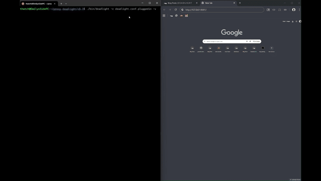

# Deadlight Proxy

A high-performance, multi-protocol proxy server written in C using GLib. 
Designed for deep packet inspection, protocol analysis, and extensibility.

---

### Table of Contents
1.  [Architecture](#architecture)
2.  [Features](#features)
3.  [Roadmap](#roadmap)
4.  [Getting Started](#getting-started)
5.  [Usage](#usage)
6.  [Extending Deadlight](#extending-deadlight)
7.  [Project Structure](#project-structure)
8.  [License](#license)
9.  [Support](#support) 

---

**Use Cases:**
- Development proxy for debugging HTTPS traffic
- SOCKS gateway for routing application traffic  
- Protocol bridge for legacy systems
- Building block for larger network applications
- Learning tool for protocol implementation



### Architecture

Deadlight’s core innovation is its decoupling of the protocol from the service.

**Stateless by Design:** Instead of maintaining a local database or a mail queue, the proxy translates TCP traffic into clean HTTP API calls. This offloads all state management to a globally available database, allowing the proxy to remain lightweight and stateless. It can be turned off without losing any data.

**Protocol Agnostic:** The proxy is not an "email server" or a "SOCKS proxy"—it’s a platform for handling any TCP-based protocol. Its modular architecture means you can add new protocol handlers (e.g., for XMPP or Matrix) as simple, self-contained C files without changing the core application.

**Secure Connectivity with Tailscale:** The proxy leverages Tailscale for secure mesh network connections, allowing seamless VPN-like gateway services. for secure, outbound-only connectivity. This means your home IP address is never exposed, your firewall can remain closed, and you don’t need to worry about dynamic IPs or complex NAT configurations. Your home machine becomes a trusted network gateway, not a public server.

Deadlight is built on a modular design managed by a central `DeadlightContext`. A connection flows through the system as follows:
1.  The **Main Thread** runs a `GSocketService`, accepting new connections.
2.  Incoming connections are passed to a **Worker Thread** from a `GThreadPool`.
3.  The worker thread performs **Protocol Detection** by peeking at the initial bytes of the connection.
4.  The appropriate registered `DeadlightProtocolHandler` is invoked to handle the connection.
5.  The handler processes the request. It can either complete the request synchronously or, for long-lived tunnels, hand off control to **asynchronous I/O watchers** on its own thread's event loop. This prevents the worker thread from blocking.

This is all managed by a set of distinct managers:
-   **Network Manager**: Handles listener sockets, the worker pool, and connection state.
-   **SSL Manager**: Manages GIO/gnutls contexts, CA certificates, and performs SSL interception.
-   **Protocol System**: Manages the registration and detection of protocol handlers.
-   **Configuration Manager**: Parses INI-style configuration files.
-   **Connection Pool**: Manages and reuses upstream server connections.

### Features

- **High-Performance C Foundation:** Built with the robust and efficient GLib ecosystem for high-throughput, low-latency network I/O and multi-threaded connection handling.

- **Multi-Protocol Support:** A single binary can act as a bridge for HTTP/HTTPS, SOCKS, SMTP, IMAP/S, Websocket, FTP (with command inspection) and a custom API.

- **API-First Design:** Complete REST API for external integration, enabling real-time status monitoring, email sending, and federation from any web application.

- **Email-based Federation:** A simplified approach to decentralized social media that uses proven email protocols for instance-to-instance communication, eliminating the need to invent a new protocol.

- **Advanced Security:** Features include on-the-fly TLS interception (for development/analysis), robust certificate validation, and a secure deployment model that leverages outbound-only connections.

 **Advanced Multi-Protocol Support:**
   - **HTTP/1.1 & HTTPS:** Full proxying with a robust `CONNECT` tunnel implementation.
   - **SSL/TLS Interception (MITM):** Full Man-in-the-Middle capability with on-the-fly certificate generation for deep traffic analysis.
   - **WebSocket (Terminating Proxy):** Acts as a true WebSocket endpoint, enabling frame-by-frame inspection, logging, and manipulation.
   - **FTP (Intelligent Proxying):** Full command inspection and dynamic rewriting of `PASV` responses to transparently proxy passive mode data connections.
   - **SOCKS4/4a & SOCKS5:** Standardized support for versatile TCP-level proxying.
   - **IMAP/S & SMTP:** Basic support for email protocols, including `STARTTLS`.
   - **Custom API:** A built-in API for management and integration.

**API Endpoints:**
- `GET /api/blog/status` - Blog service health and version info
- `GET /api/email/status` - Email queue status and processing metrics
- `POST /api/email/send` - Send emails through proxy SMTP bridge
- `POST /api/federation/send` - Federated blog post distribution via email

## Using as a Component

Deadlight Proxy can be embedded in larger systems:

- **REST API Integration**: Control the proxy programmatically
- **Custom Protocol Handlers**: Add application-specific protocols
- **Tailscale Mesh**: Deploy as a secure network gateway
- **Example**: See [edge.deadlight](https://github.com/gnarzilla/edge.deadlight) 
  for a full platform implementation using this proxy as a component

---

### Roadmap
#### v1.0 (Current):

+ **API-First:** Full REST API for real-time status and management.
+ **Tailscale Mesh Deployment:** Simplified private access to remote servers leveraging Tailscale's network.
+ **Plugin Ecosystem:** API for creating and sharing ad-blocking, analytics, and other plugins.
+ **Local Web Interface:** A minimalist web server within the proxy for easy, direct configuration and debugging.

#### Next Steps
- **Enhance FTP Handler:** Add support for `PORT` (active) mode to complement the existing `PASV` implementation. Improve data channel error reporting back to the control channel.
- **Refine Protocol Detection:** The detection system is functional, but could be enhanced with a more explicit priority system to prevent conflicts (e.g., the initial HTTP vs. WebSocket issue).
- **Mobile & Desktop Clients:** Publish an API specification for the development of native clients.

---


### Getting Started

#### Prerequisites

-   A C99 compliant compiler (GCC or Clang)
-   `make`
-   `pkg-config`
-   GLib 2.0+ & GIO development libraries (`libglib2.0-dev`)
-   gnutls development libraries (`gnutls`)

On Debian/Ubuntu, install all prerequisites with:
```bash
sudo apt-get update
sudo apt-get install build-essential pkg-config libglib2.0-dev libssl-dev glib-networking libmicrohttpd-dev
```
- `build-essential`: Provides gcc, make, etc.
- `libglib2.0-dev`: The GLib core libraries and development headers.
- `gnutls`: GNU TLS functions.
- `glib-networking`: The essential backend for GIO's TLS functionality.

#### Building

Clone the repository and use the provided Makefile:
```bash
git clone https://github.com/gnarzilla/proxy.deadlight
cd proxy.deadlight
make clean && make UI=1
```
The executable will be located at `bin/deadlight`.

#### Configuration

The proxy uses an INI-style configuration file. A sample is provided at `deadlight.conf.example`.

```ini
[core]
port = 8080
bind_address = 0.0.0.0
max_connections = 500
log_level = info
worker_threads = 4

[ssl]
enabled = true
ca_cert_file = /home/thatch/.deadlight/ca/ca.crt
ca_key_file = /home/thatch/.deadlight/ca/ca.key
cert_cache_dir = /tmp/deadlight_certs

[protocols]
http_enabled = true
https_enabled = true
connect_enabled = true

[plugins]
enabled = false

[imap]
# The upstream IMAP server to proxy connections to.
upstream_host = imap.gmail.com
upstream_port = 143

[imaps]
# The upstream IMAPS server to proxy connections to.
# This uses SSL/TLS on port 993.
upstream_host = imap.gmail.com
upstream_port = 993

[ftp]
# The upstream FTP server to proxy connections to when none is specified.
upstream_host = ftp.gnu.org
upstream_port = 21

```

#### Running
```bash
./bin/deadlight -c deadlight.conf.example
```
Add deadlight certificate to the trust store. If using Firefox you will also need to add via firefox's settings.
```bash
sudo cp ~/.deadlight/ca/ca.crt /usr/local/share/ca-certificates/
sudo update-ca-certificates
```

### Usage

#### Example 1: HTTP/HTTPS Web Proxy

Configure your browser or system to use `http://localhost:8080` as its proxy. Or, use `curl`:

```bash
# Proxy a standard HTTP request
curl -x http://localhost:8080 http://example.com

# Proxy an HTTPS request (using the CONNECT method)
curl -x http://localhost:8080 https://example.com
```


#### Example 2: SOCKS4 Privacy Proxy

Use `curl` to route a request through the SOCKS4 handler:
```bash
curl --socks4 localhost:8080 http://example.com
```

#### Example 3: Status API
```bash
curl http://localhost:8080/api/status
```

#### Example 4: Connection stats
```bash
curl http://localhost:8080/api/connections
```

#### Example 5: IMAPS Secure Tunnel

Test the secure IMAP tunnel using `telnet` (this proves the TLS handshake and tunneling):
```bash
telnet localhost 8080
```
Once connected, type the following and press Enter:
```text
a001 NOOP
```
The proxy will establish a secure TLS connection to the upstream IMAP server and tunnel the data.

#### Example 6: FTP Passive Mode Proxying
Connect to the proxy with a full-featured FTP client like FileZilla or `lftp`, using `localhost` as the host and `8080` as the port. The proxy will handle the `PASV` command and correctly rewrite the data connection address.

Alternatively, for a quick command-line test:
```bash
printf "USER anonymous\r\nPASV\r\n" | nc localhost 8080
```

#### Command Line Options

-   `-c, --config FILE`: Path to configuration file.
-   `-p, --port PORT`: Port to listen on (overrides config).
-   `-d, --daemon`: Run as a background daemon.
-   `-v, --verbose`: Enable verbose (debug) logging.
-   `-h, --help`: Show help message.

#### Proxying HTTP
```bash
curl -x http://localhost:8080 http://example.com
```

#### Proxying & Intercepting HTTPS
For TLS interception to work, you must instruct your client to trust the proxy's Certificate Authority. The CA certificate is generated automatically (e.g., in `~/.deadlight/ca/ca.crt`).

```bash
# The --cacert flag tells curl to trust our custom CA for this one request.
curl --cacert ~/.deadlight/ca/ca.crt -x http://localhost:8080 https://example.com
```

## Extending Deadlight

The DeadlightProtocolHandler interface and table-driven detection system make extending the proxy simple and powerful. To add a new protocol, you implement a few functions and add detection rules - the core handles everything else.

### Adding a New Protocol

To add support for a new protocol:

1. **Create protocol files** in `src/protocols/`: `my_protocol.c` and `my_protocol.h`

2. **Implement the DeadlightProtocolHandler interface:**
   - `detect`: Inspects initial bytes and returns a priority (0 = no match, higher = better match)
   - `handle`: Main function to process the connection. Returns:
     - `HANDLER_SUCCESS_CLEANUP_NOW` for synchronous completion
     - `HANDLER_SUCCESS_ASYNC` for async operations
     - `HANDLER_ERROR` on failure
   - `cleanup`: Optional protocol-specific cleanup

3. **Add detection rules** in `src/core/protocol_detection.c`:
   ```c
   // Add to protocol_table array
   {
       .name = "MyProtocol",
       .protocol_id = DEADLIGHT_PROTOCOL_MYPROTOCOL,
       .priority = 30,
       .rules = my_protocol_rules,
       .rule_count = 1
   }
   ```

4. **Update core files:**
   - Add enum value to `DeadlightProtocol` in `deadlight.h`
   - Add case to `deadlight_protocol_to_string()` in `protocols.c`
   - Register handler in `deadlight_protocols_init()` in `protocols.c`

5. **Add to Makefile:** Add `src/protocols/my_protocol.c` to `PROTOCOL_SOURCES`

6. **Recompile:** Your protocol is now live!

The table-driven detection system supports multiple matching types (exact, prefix, contains, custom) and compound rules (AND/OR), making it easy to handle complex protocol signatures.

### Project Structure
```
deadlight/
├── bin/                    # Compiled binaries
├── obj/                    # Compiled object files
├── ssl/                    # Directory for SSL certificates
├── src/
│   ├── core/               # Core modules (main, context, config, network, etc.)
│   ├── plugins/            # Built-in plugin implementations
│   └── protocols/          # Protocol handler implementations
├── deadlight.conf.example  # Example configuration file
├── Makefile                # Build configuration
└── README.md               # This file
```

### License

This project is licensed under the MIT License - see the [LICENSE](LICENSE) file for details.


### Support

[Support is greatly appreciated! - ko-fi/gnarzilla](https://ko-fi.com/gnarzilla)
